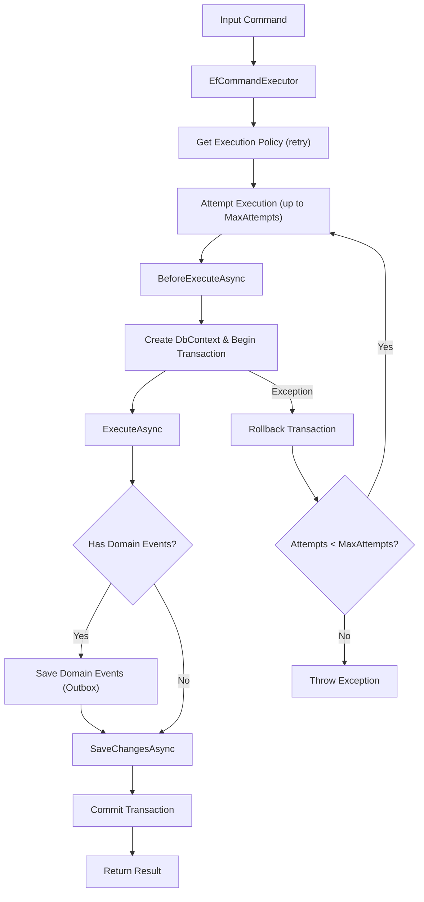
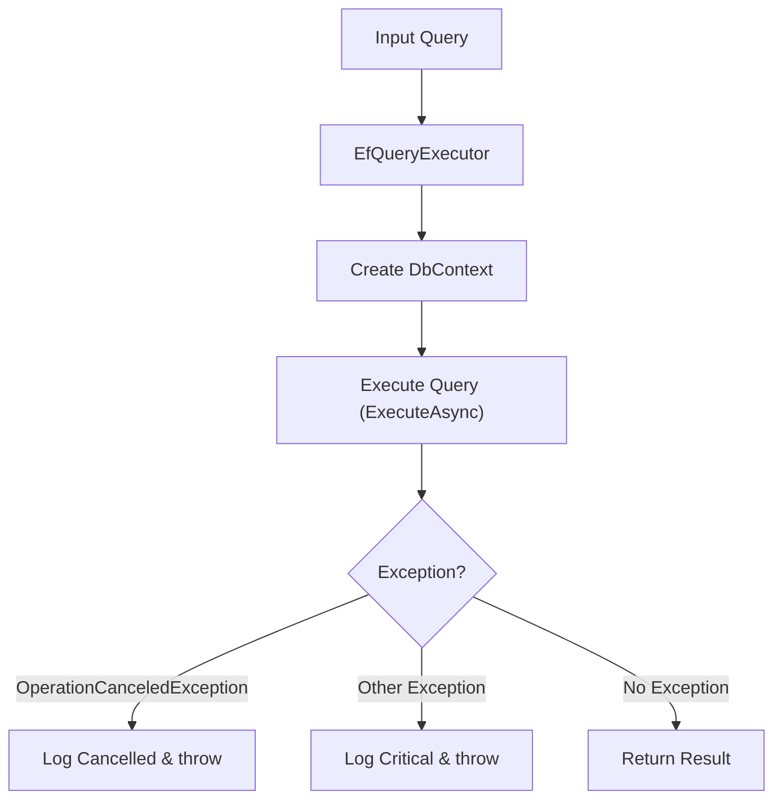
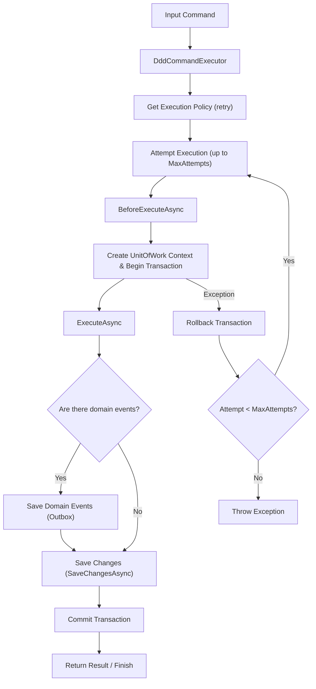
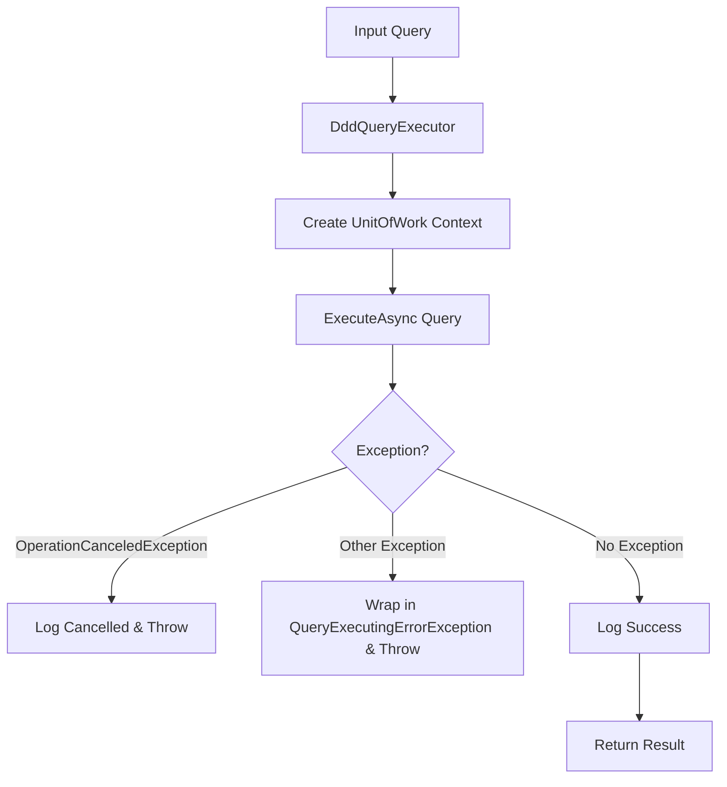

# Eladei.Architecture

**Lightweight CQRS + DDD / Entity Framework Executor for .NET**  

`Eladei.Architecture` is a set of libraries for implementing commands and queries with support for CQRS, DDD, EF Core, and Outbox.

## Libraries

| Library | Description |
|------------|------------|
| `Eladei.Architecture.Cqrs` | Base abstractions and classes for working with commands and queries. |
| `Eladei.Architecture.Cqrs.Ddd` | Command and query implementation with DDD support. Commands and queries operate on the domain model (Application Layer). |
| `Eladei.Architecture.Cqrs.EntityFramework` | Command and query implementation using EF Core in the Transaction Script style. Commands and queries can be part of the Domain Layer. |
| `Eladei.Architecture.Ddd` | Base types for implementing tactical DDD patterns. |
| `Eladei.Architecture.Jobs.Quartz` | Helper classes for working with Quartz. |
| `Eladei.Architecture.Logging` | Base types for logging. |
| `Eladei.Architecture.Messaging` | Base types for integration event processing. |
| `Eladei.Architecture.Messaging.Kafka` | Types for working with integration events via Kafka. |
| `Eladei.Architecture.Tests.EntityFramework` | Base types for building integration and unit tests focused on Entity Framework. |

---

## Main concepts

### Commands
- Executed through `DddCommandExecutor` or `EfCommandExecutor`.
- Can persist domain events into the Outbox.
- **Outbox** — ensures reliable message delivery: command execution results and events are stored within the same transaction, while event publishing is performed by a separate process.
- If an error occurs, the transaction is rolled back, and neither events nor execution results are persisted.

### Queries
- Executed through `DddQueryExecutor` or `EfQueryExecutor`.
- Return read models without modifying state.

### Outbox
- After successful command execution, all domain events are stored in the Outbox.
- Can be integrated with a message bus or another event-processing mechanism.
- Atomicity is guaranteed: either both command results and events are persisted, or everything is rolled back.

---

## Quick Examples

### 1. EF example (transaction script)
```csharp
// Command executor
var commandExecutor = new EfCommandExecutor<BookRatingDbContext>( 
    contextFactory,
    new MockOperationExecutionPolicyService(),
    new MockOutboxDomainEventDao(eventDaoLogger));

// Query executor
var queryExecutor = new EfQueryExecutor<BookRatingDbContext>(contextFactory);

// Execute command
var registerBookCommand = new RegisterBookCommand("Капитанская дочка", "А.С.Пушкин");

var bookId = await commandExecutor.ExecuteAsync(registerBookCommand, CancellationToken.None);

// Execute query
var findBookQuery = new FindBookByIdQuery(bookId);

var bookInfo = await queryExecutor.ExecuteAsync(findBookQuery, CancellationToken.None);
```

#### EF Command Executor Workflow


#### EF Query Executor Workflow


### 2. DDD Example (Application Layer + Domain Model)
```csharp
// Command executor
var commandExecutor = new DddCommandExecutor(
    contextFactory,
    new MockOperationExecutionPolicyService(),
    new MockOutboxDomainEventDao(eventDaoLogger));

// Query executor
var queryExecutor = new DddQueryExecutor(contextFactory);

 // Execute command
var registerBookCommand = new RegisterBookCommand("Капитанская дочка", "А.С. Пушкин");

var bookId = await _commandExecutor.ExecuteAsync(registerBookCommand, CancellationToken.None);

// Execute query
var query = new FindBookByIdQuery(bookId);

var foundBook = await queryExecutor.ExecuteAsync(query, CancellationToken.None);
```

#### DDD Command Executor Workflow


#### DDD Query Executor Workflow


#### Notes
- In the EF scenario, commands interact directly with the database through the DbContext (Transaction Script).
- In the DDD scenario, commands operate through the Application Layer by modifying aggregates and producing domain events.
- Command execution results and Outbox events are persisted only after a successful transaction commit.

Full examples: /samples/ConsoleExamples

## Samples
### ConsoleExamples
- CqrsWithDddExecuting - console application demonstrating command and query execution using the DDD approach.
- CqrsWithEntityFrameworkExecuting - console application demonstrating command and query execution using the Transaction Script approach with Entity Framework.

#### Notes
The DDD-based domain model is intentionally simplified to demonstrate how the library works. In real-world projects, DDD should only be used for complex business logic.

### Microservices (production-ready)
- BookRating: CQRS + transaction script + Outbox + Kafka
- BookInfo: CQRS + transaction script + Outbox + Kafka

## Roadmap / TODO
- Unit tests for CQRS libraries (planned)
- Unit and integration tests for microservice samples
- Example microservice with a full-featured DDD implementation