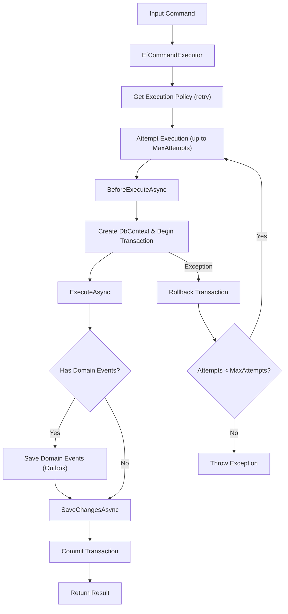
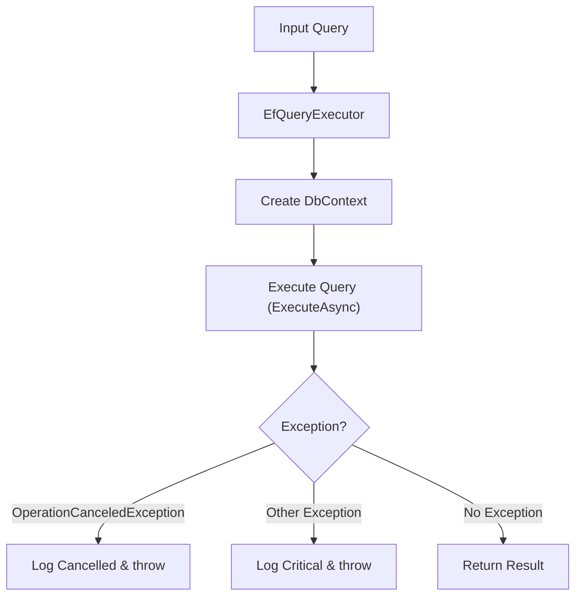
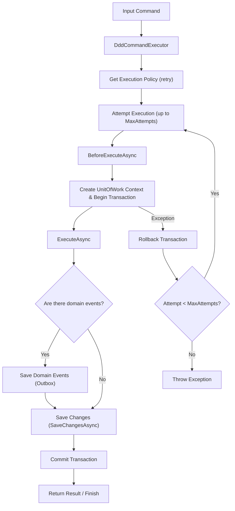
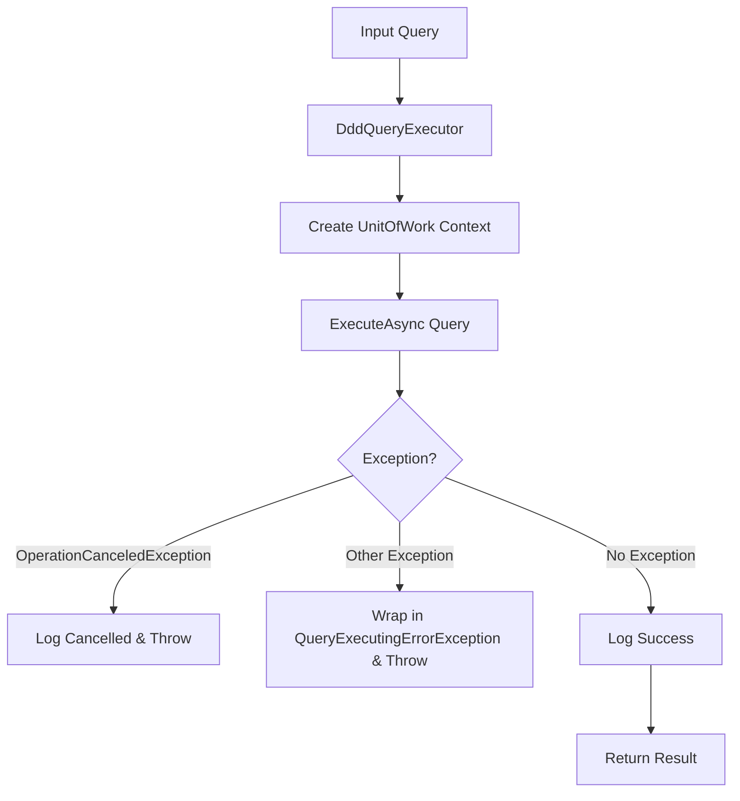

# Eladei.Architecture

**Lightweight CQRS + DDD / Entity Framework Executor for .NET**  

`Eladei.Architecture` — это набор библиотек для реализации команд и запросов с поддержкой CQRS, DDD, EF Core, Outbox.

## Библиотеки

| Библиотека | Назначение |
|------------|------------|
| `Eladei.Architecture.Cqrs` | Базовые абстракции и классы для работы с командами и запросами. |
| `Eladei.Architecture.Cqrs.Ddd` | Реализация команд и запросов с поддержкой DDD. Команды и запросы работают с доменной моделью (Application layer). |
| `Eladei.Architecture.Cqrs.EntityFramework` | Реализация команд и запросов через EF Core в стиле Transaction Script. Команды и запросы могут быть частью Domain layer. |
| `Eladei.Architecture.Ddd` | Базовые типы для реализации тактических шаблонов DDD. |
| `Eladei.Architecture.Logging` | Базовые типы для логирования. |
| `Eladei.Architecture.Messaging` | Базовые типы для обработки событий интеграции. |
| `Eladei.Architecture.Messaging.Kafka` | Типы для работы с событиями интеграции через Kafka. |
| `Eladei.Architecture.Tests.EntityFramework` | Базовые типы для формирования интеграционных и unit-тестов, ориентированных на Entity Framework. |

---

## Основные концепции

### Команды
- Исполняются через `DddCommandExecutor` или `EfCommandExecutor`.
- Могут сохранять доменные события в Outbox.
- **Outbox** — обеспечивает надежную доставку сообщений: результаты выполнения команды и события сохраняются в одной транзакции, а события отправляются отдельным процессом.
- При ошибке транзакция откатывается (Rollback), события и результат не сохраняются.

### Запросы
- Исполняются через `DddQueryExecutor` или `EfQueryExecutor`.
- Возвращают read-model без изменения состояния.

### Outbox
- После успешного выполнения команды все доменные события сохраняются в Outbox.
- Можно интегрировать с шиной сообщений или другим обработчиком событий.
- Гарантируется атомарность: либо результат выполнения команды и события сохраняются, либо откат.

---

## Quick Examples

### 1. EF example (transaction script)
```csharp
// Исполнитель команд
var commandExecutor = new EfCommandExecutor<BookRatingDbContext>(
    contextFactory,
    new MockOperationExecutionPolicyService(),
    new MockOutboxDomainEventDao(eventDaoLogger));

// Исполнитель запросов
var queryExecutor = new EfQueryExecutor<BookRatingDbContext>(contextFactory);

// Выполнить команду
var registerBookCommand = new RegisterBookCommand("Капитанская дочка", "А.С.Пушкин");

var bookId = await commandExecutor.ExecuteAsync(registerBookCommand, CancellationToken.None);

// Выполнить запрос
var findBookQuery = new FindBookByIdQuery(bookId);

var bookInfo = await queryExecutor.ExecuteAsync(findBookQuery, CancellationToken.None);
```

#### Схема работы исполнителя EF Command


#### Схема работы исполнителя EF Command EF Query


### 2. DDD Example (Application Layer + Domain Model)
```csharp
// Исполнитель команд
var commandExecutor = new DddCommandExecutor(
    contextFactory,
    new MockOperationExecutionPolicyService(),
    new MockOutboxDomainEventDao(eventDaoLogger));

// Исполнитель запросов
var queryExecutor = new DddQueryExecutor(contextFactory);

 // Выполнить командy
var registerBookCommand = new RegisterBookCommand("Капитанская дочка", "А.С. Пушкин");

var bookId = await _commandExecutor.ExecuteAsync(registerBookCommand, CancellationToken.None);

// Выполнить запрос
var query = new FindBookByIdQuery(bookId);

var foundBook = await queryExecutor.ExecuteAsync(query, CancellationToken.None);
```

#### Схема работы исполнителя EF Command


#### Схема работы исполнителя EF Command EF Query


#### Notes
- В EF-сценарии команды напрямую взаимодействуют с БД через контекст (Transaction Script).
- В DDD-сценарии команды работают через Application Layer, изменяя агрегаты и формируя доменные события.
- Сохранение результатов выполнения команд и события в Outbox осуществляется только при успешном завершении транзакции.

Full examples: /samples/ConsoleExamples

## Samples
### ConsoleExamples
- CqrsWithDddExecuting - консольное приложение, демонстрирующее выполнение команд и запросов с использованием DDD-подхода.
- CqrsWithEntityFrameworkExecuting - консольное приложение, демонстрирующее выполнение команд и запросов с использованием transaction script на базе Entity Framework.

#### Notes
Доменная модель на основе DDD намеренно упрощена для демонстрации работы библиотеки. В реальных проектах DDD необходимо использовать только для сложной бизнес-логики.

### Microservices (production-ready)
- BookRating: CRUD + Outbox + Kafka
- BookInfo: CRUD + Outbox + Kafka

## Roadmap / TODO
- Unit-тесты для CQRS-библиотек (планируется)
- Unit-тесты и интеграционные тесты для примеров микросервисов
- Пример микросервиса с полноценной DDD-реализацией